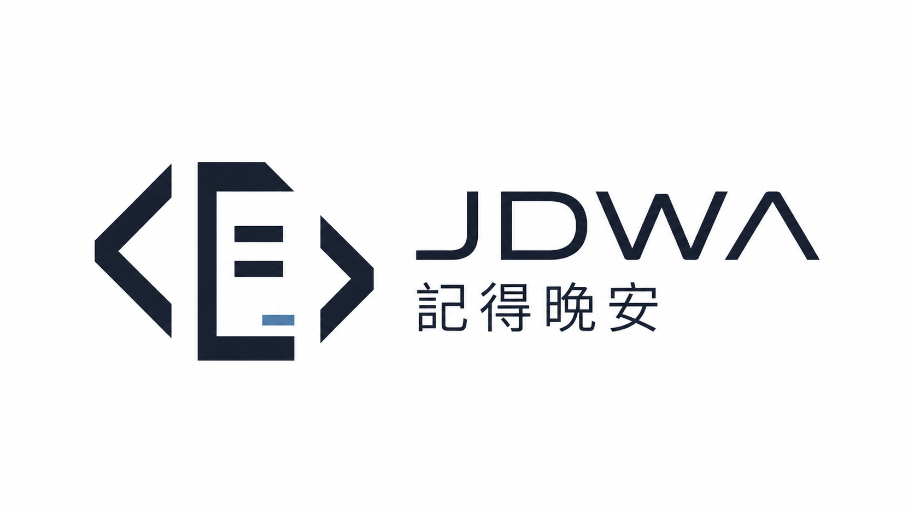

# JDWA 记得晚安

JDWA 记得晚安是一个面向 AI 编程工作流的桌面管理工具，用来统一管理 Claude Code、ChatGPT、Gemini、Hermes 和 OpenClaw 的供应商配置、MCP、提示词、Skills 与会话相关能力。



## 项目定位

- **项目交付**：沉淀新项目启动、旧项目接手、配置迁移和交付验收流程。
- **工程可靠**：使用 SQLite、原子写入、备份与清晰的数据边界保护配置。
- **效率标准化**：把多工具供应商切换、MCP 管理、提示词和 Skills 管理收束到一个桌面入口。

## 支持工具

- Claude Code
- ChatGPT
- Gemini
- Hermes
- OpenClaw

## 本地数据

JDWA 默认使用 `~/.jdwa` 作为本地配置目录：

- `~/.jdwa/jdwa.db`：SQLite 主数据库
- `~/.jdwa/settings.json`：设备级设置
- `~/.jdwa/backups/`：数据库备份
- `~/.jdwa/skills/`：JDWA 管理的 Skills 主副本

## 开发

```bash
pnpm install
pnpm run dev
```

常用检查：

```bash
pnpm run typecheck
pnpm run build:renderer
```

## 发布

GitHub Releases 会生成 `latest.json` 给 Tauri updater 使用：

```text
https://github.com/AAASS554/jdwa-ai_evn/releases/latest/download/latest.json
```

第一版 macOS 包暂不做 Apple Developer ID 签名/公证，适合早期测试和手动安装；正式公开分发前建议补齐 Apple 签名与公证流程。
